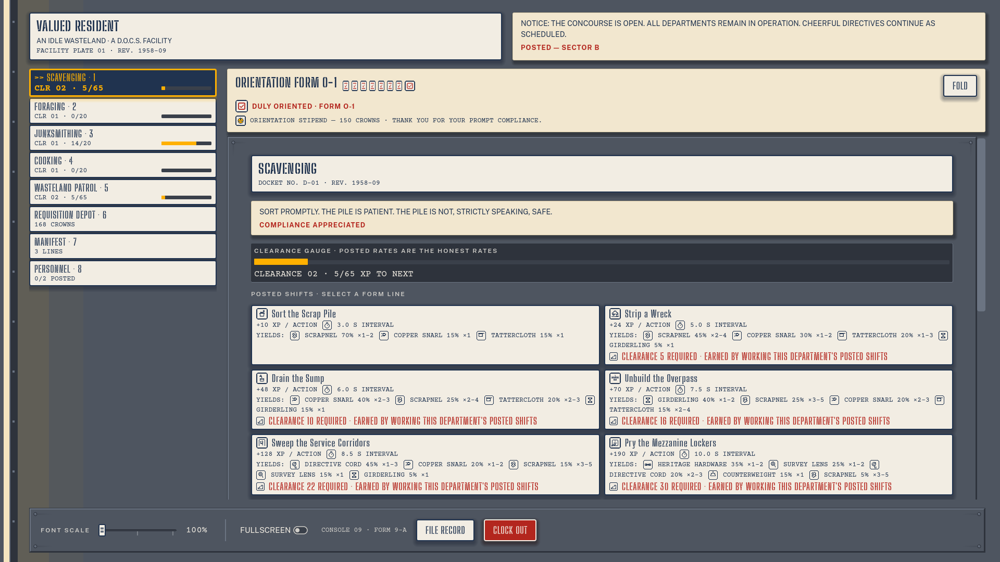
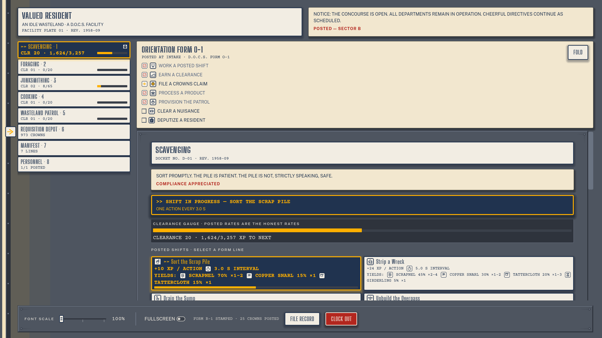
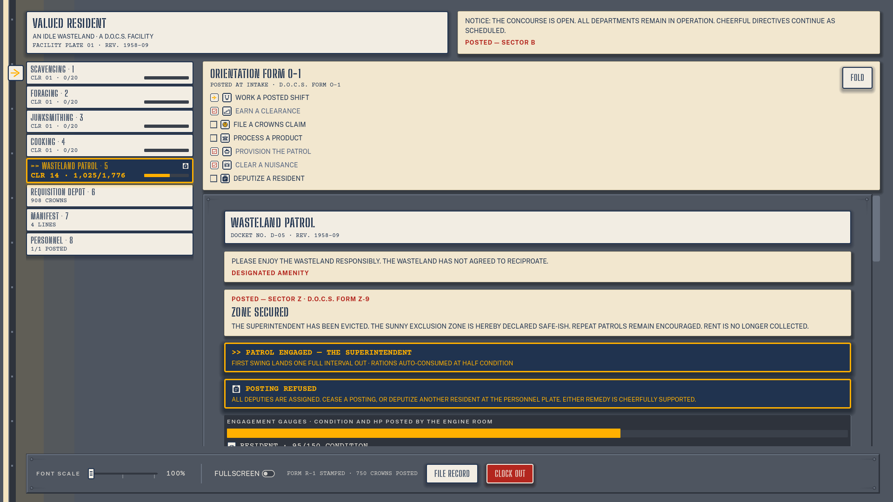

# Valued Resident

**Train a skill. Earn a clearance. Let the shelter file your progress while you are away.**

Valued Resident is a desktop idle game set inside an atompunk shelter’s cheerfully bureaucratic interface. Gather supplies, process materials, build equipment, and run automatic patrols. Activity rates, requirements, and rewards are posted in the same institutional language as its department signs and forms.

This is the source repository named `fallout-idle`. The game’s presentation and content use the Valued Resident identity.



*The eight-department concourse in a review fixture with orientation completed. This is not a pristine first-run save.*

[Run from source](#run-from-source) · [Controls](#controls) · [Content schema](docs/content-schema.md) · [Asset credits](ASSETS.md)

> **Status:** pre-release desktop hobby project. No prebuilt binary is provided by the documented quickstart; open the source project in Godot to play. Progress is stored locally, without accounts or cloud sync.

## Clock in

A new game opens with **ORIENTATION FORM O-1**, a seven-step checklist that leads you through working a shift, earning a clearance, making a sale, processing a product, provisioning a patrol, winning a fight, and appointing a deputy.

The guide points to the next department and reveals the relevant tab or control. If you still need supplies, it directs you toward gathering them instead of pretending the next step is ready. Completing the form records the orientation and awards its stipend.

The longer loop is straightforward:

**Gather → process → equip → patrol → unlock more work.**

| Department | What happens there |
|---|---|
| **Scavenging** | Gather salvage and climb the activity tiers |
| **Foraging** | Collect supplies for food and other processing |
| **Junksmithing** | Turn materials into crafted items and equipment |
| **Cooking** | Prepare food for patrols |
| **Wasteland Patrol** | Run automatic combat through the available zones |
| **Requisition Depot** | Buy stock or sell items you own for Crowns |
| **Manifest** | Inspect inventory and equipment |
| **Personnel** | Add staffing capacity for simultaneous work |

## Read the numbers before committing



*The skill docket puts activities, clearance requirements, and progress into the shelter’s posted-card interface.*

Skill levels act as **clearances** that unlock activities and recipes. Gathering offers nine activity tiers per skill, while Junksmithing and Cooking each have 20 recipes in the current content set. Four equipment tiers extend the preparation loop beyond the opening kit.

Each of the five skills also carries a **23-objective Departmental Dossier**, for 115 objectives across the game. Stamps accumulate as you work. Merit pay and experience rewards are applied automatically; there is no separate claim-button routine for each completed objective.

The content files define the rates and reward tables. Use the on-screen information and [balance notes](docs/balance-notes.md) to understand the current numbers rather than assuming an unlock will be worthwhile solely because it is newer.

## Put more hands to work

You begin with one available **posting**, so choosing work is initially a choice about where to spend that capacity. Deputizing residents through Personnel lets more skills run at the same time, up to the five skill departments.

If no posting is free, the game refuses the new assignment with a reason instead of silently stopping another skill. Where offered, **REASSIGN** provides an explicit way to move a named posting after validating the requested work.

At the Depot, BUY and SELL are different views. SELL uses your own holdings and offers quantities of 1, 10%, 25%, 50%, 100%, or a custom amount. Percentage quantities round down; a result of zero is disabled. The custom field previews the amount and value, and refuses out-of-range quantities rather than quietly changing your request.

## Provision the patrol



*This fixture revisits the Superintendent after a zone clear and includes a genuine POSTING REFUSED notice. It illustrates the patrol interface and feedback, not an uninterrupted first victory.*

Patrols occupy a posting like other skills. Equipment, accuracy, attack speed, damage, and food affect the automatic battles. Food is consumed automatically at or below half health, using the strongest available healing food first. A death ends the patrol without removing inventory or currency.

The current content includes two zones and their bosses: the **Sunny Exclusion Zone** and **The Gift Court**. Later encounters require higher clearances and better preparation; the interface keeps zone choices and requirements visible.

## Leave, return, and check the mail

Offline progression uses elapsed time without a fixed hour cap. Processing stops when inputs run out; exceptionally long combat catch-up is limited by a 5,000,000-event safety budget. On return, **MAIL CALL** summarizes the gains and completed objective stamps. An offline patrol that cannot survive is recalled just before a lethal blow would land, preserving its pre-blow health rather than continuing to earn combat rewards indefinitely.

Saves live in Godot’s per-user `user://` directory, outside the repository. The save system uses a versioned format, atomic-write handling, and rotating backups; its current version supports migration from earlier formats. These protections are local. They do not create a cloud copy or guarantee recovery if all local save files are lost.

See [the save schema](docs/save-schema.md) before modifying or moving game data.

## Controls

| Key | Action |
|---|---|
| **1–8**, including numpad | Jump to a department; 8 opens Personnel |
| **Tab / Shift+Tab** | Move focus through controls |
| **Arrow keys** | Navigate department plates and relevant tab groups |
| **Enter / Space** | Activate the focused control |
| **Escape** | Acknowledge Mail Call or return from a tutorial-directed department jump |
| **Mouse** | Select departments, activities, and controls directly |

Department shortcuts stand down while you are typing in a text field. Ctrl, Cmd, and Alt combinations are left to the operating system. Font scaling offers **100%, 150%, and 200%** settings, and the active department is marked by text/shape changes as well as color.

## Run from source

Use the standard GDScript build of **Godot 4.7**; the repository documents development and testing with **4.7.2-stable**. The project uses the GL Compatibility renderer and a 1280×720 starting window.

```sh
git clone https://github.com/Arrangedgodly/fallout-idle.git
cd fallout-idle
```

1. Open Godot’s project manager and import `project.godot`.
2. Wait for the initial asset import.
3. Press **F5** to run the configured main scene.

For a command-line asset import:

```sh
godot --headless --path . --import
```

Use your actual Godot executable name or path if it differs. There is no npm dependency installation or browser server in this workflow.

## Data-driven systems

| Layer | Implementation |
|---|---|
| Engine and UI | Godot 4.7 with GDScript and the Compatibility renderer |
| Content | JSON records for skills, activities, items, recipes, zones, enemies, staffing, and objectives |
| Loading | Validation into typed runtime data |
| Persistence | Local versioned saves and backups |
| Tests | Vendored GUT suites |
| Visual assets | Original SVG icon/texture system and bundled fonts |

Content is maintained under `data/`. The [content schema](docs/content-schema.md) defines the records and their relationships, while [balance notes](docs/balance-notes.md) explain the economy and combat calculations. Change content through those contracts instead of scattering unexplained numbers through UI code.

## Test changes

The test runner uses a shell script. Its default Godot path is the Steam macOS installation, so supply your own path on another setup:

```sh
GODOT=/path/to/godot ./run_tests.sh
```

The script imports assets, runs the GUT suite, and propagates failures. It also checks collection rather than treating a run with no collected tests as a success. Use the current output as the test result; screenshots or a successful window launch do not replace the suite.

The screenshots here come from the project’s actual renderer and committed visual-probe fixtures. Their staged progress is identified in the captions. They are not a claim that every scenario, platform, save migration, or input path has been manually verified.

## Current scope

- Desktop source project, with no documented prebuilt download in the quickstart
- Local progression, without sign-in, multiplayer, cloud sync, or telemetry
- A pre-release game whose balance and content may change
- The subtitle containing “Wasteland” remains marked for naming review before wider distribution

## License and credits

Project code and original assets are [MIT-licensed](LICENSE). [ASSETS.md](ASSETS.md) records asset provenance, including the original SVG theme and icons. Big Shoulders Stencil Display, Public Sans, and Courier Prime retain their bundled SIL OFL notices. GUT is a separately MIT-licensed development tool.

Further documentation: [save format](docs/save-schema.md) · [theme contrast evidence](docs/theme-contrast-table.md) · [content contracts](docs/content-schema.md)
